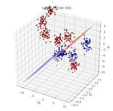

[](https://travis-ci.com/Doctorado-ML/STree)

# Stree

Oblique Tree classifier based on SVM nodes



## Examples

### Jupyter notebooks

##### Slow launch but better integration

* [](https://mybinder.org/v2/gh/Doctorado-ML/STree/master?urlpath=lab/tree/test.ipynb) Test notebook

##### Fast launch but have to run first commented out cell for setup

* [](https://colab.research.google.com/github/Doctorado-ML/STree/blob/master/test.ipynb) Test notebook

* [](https://colab.research.google.com/github/Doctorado-ML/STree/blob/master/test2.ipynb) Another Test notebook

* [](https://colab.research.google.com/github/Doctorado-ML/STree/blob/master/test_graphs.ipynb) Test Graphics notebook

### Command line

```python
python main.py
```

## Tests

```python
python -m unittest -v tests.Stree_test tests.Snode_test
```
